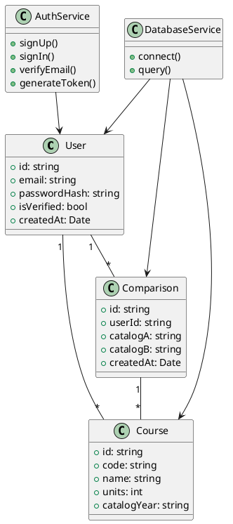

# UML Class Diagram

Last Updated: June 3, 2026

This document contains the UML Class Diagram for the CalPolyQ2S project.

The source file for the diagram is stored in `docs/uml-class-diagram.puml`.

## Diagram Links

- Lucidchart diagram: https://lucid.app/lucidchart/8b21c88c-ae28-4f27-89df-a06299825d95/edit?invitationId=inv_8d141c0b-dc16-4708-b72f-223c19b9046d&page=0_0#

## Diagram Overview

The diagram describes the main domain objects and their relationships for the application, including user authentication, course data, and comparison data.

## Source File

Use a PlantUML-compatible renderer to view `docs/uml-class-diagram.puml`.

